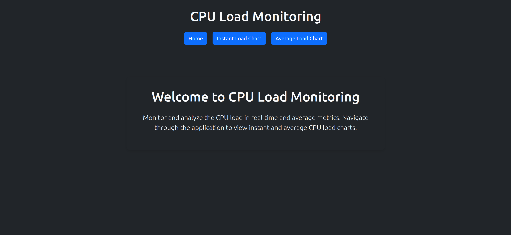
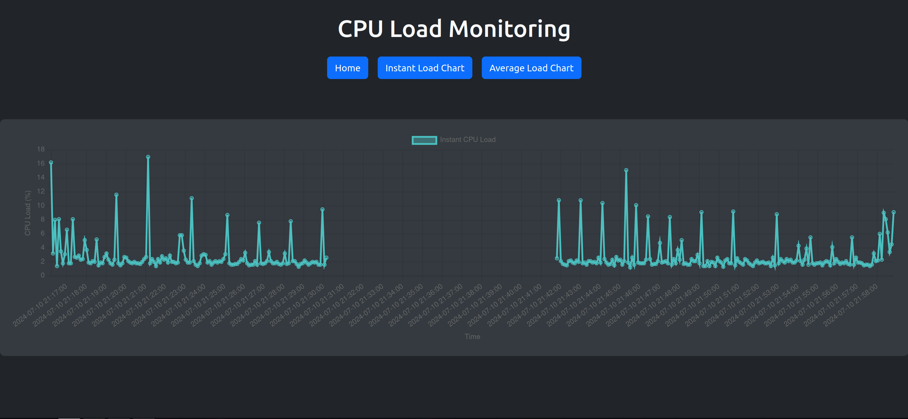
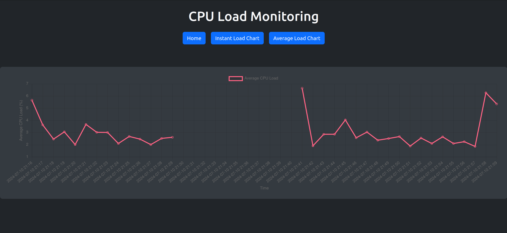

# CPU Manager

## Описание проекта

CPU Load Manager — это приложение для мониторинга загрузки процессора. Оно собирает данные о загрузке ЦП в реальном времени и предоставляет их через API. Также оно вычисляет среднюю загрузку ЦП за последние 60 минут и определяет периоды, когда загрузка ЦП отсутствует.

## Технологии

- **Backend**: Python, FastAPI, SQLAlchemy, SQLite
- **Frontend**: Vue.js, Vite
- **Docker**: для контейнеризации приложений

## Функционал

- Сбор данных о загрузке ЦП в реальном времени
- API для получения данных о загрузке ЦП
- Вычисление средней загрузки ЦП за последние 60 минут
- Определение интервалов, когда загрузка ЦП отсутствует или прерывается

## Развертывание

### Требования

- Docker
- Docker Compose

### Шаги для развертывания

1. Склонируйте репозиторий:
    ```sh
    git clone https://github.com/Neekostar/CPU-Manager.git
    cd cpu-manager
    ```

2. Соберите и запустите контейнеры:
    ```sh
    docker compose up --build
    ```

3. Ваше приложение будет доступно:
    - Backend: `http://localhost:8000`
    - Frontend: `http://localhost:5173`

## API

### `GET /cpu_loads_with_gaps`

Этот маршрут возвращает данные о загрузке ЦП вместе с интервалами, в которых загрузка ЦП отсутствует или прерывается.

#### Пример ответа

```json
{
  "cpu_loads": [
    {
      "timestamp": "2023-07-07T10:18:06",
      "value": 20.5
    },
    {
      "timestamp": "2023-07-07T10:18:16",
      "value": 30.2
    }
  ],
  "gaps": [
    {
      "start_time": "2023-07-07T10:18:06",
      "end_time": "2023-07-07T10:18:16",
      "is_active": true
    },
    {
      "start_time": "2023-07-07T10:18:26",
      "end_time": "2023-07-07T10:18:36",
      "is_active": false
    }
  ]
}
```json

### `GET /average_load_last_hour`

Этот маршрут вычисляет и возвращает среднюю загрузку ЦП за последние 60 минут.
Пример ответа

### Пример ответа

```json
[
  {
    "timestamp": "2023-07-07 10:18",
    "average_load": 25.3
  },
  {
    "timestamp": "2023-07-07 10:19",
    "average_load": 27.8
  }
]
```json

## Демонстрация



